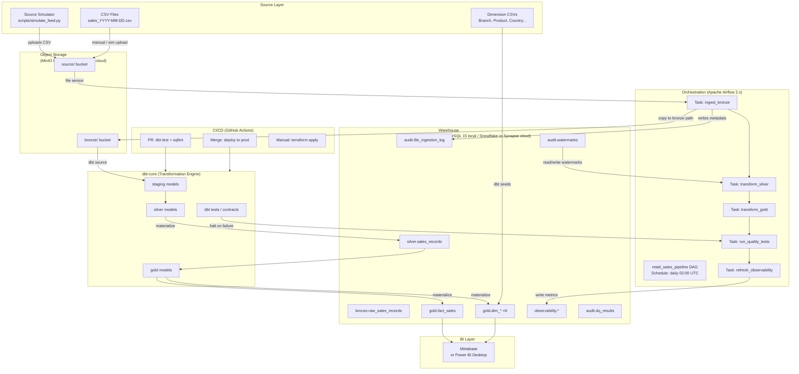
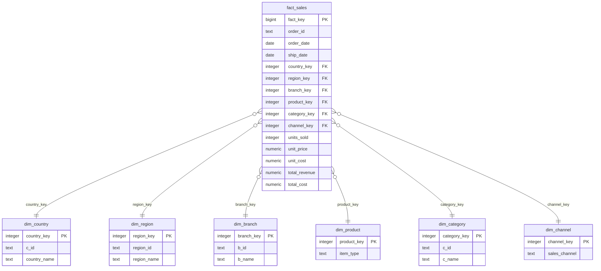

# Design Document: Retail Sales Lakehouse Migration

## Overview

This document describes the technical design for migrating a legacy SSIS/SSAS academic ETL pipeline into a modern, cloud-native data lakehouse. The system implements a **medallion architecture** (Bronze → Silver → Gold) with incremental loading via watermarking, dbt-powered transformations, Apache Airflow orchestration, automated data quality contracts, full Docker Compose local dev stack, Terraform IaC, and GitHub Actions CI/CD.

The project is designed as a portfolio-grade showcase of production data engineering practices. The local environment runs entirely in Docker with zero manual dependency installation. The same codebase deploys to cloud (Azure/AWS) by swapping Terraform variables and environment configuration.

### Goals

- Demonstrate a real end-to-end medallion lakehouse pipeline with incremental processing
- Enforce data quality contracts that fail loudly, preventing bad data from propagating downstream
- Provide full observability: pipeline logs, row counts, freshness metrics, alerting
- Be completely reproducible: `docker compose up` starts the entire local stack
- Be cloud-portable: Terraform modules provision cloud equivalents of every local service

### Non-Goals

- Real-time/streaming ingestion (batch daily is sufficient for portfolio scope)
- Multi-tenant or multi-source federation beyond the defined retail CSV schema
- Production SLA guarantees (portfolio use; cloud deploy is for demonstration)

---

## Architecture

### High-Level Architecture



### Medallion Layer Summary

| Layer | Storage Location | Materialization | Transformation | Purpose |
|-------|-----------------|----------------|----------------|---------|
| Source | `source/` bucket | CSV files | None | Raw uploads from simulator or manual drop |
| Bronze | `bronze/` bucket + `bronze.raw_sales_records` | Immutable CSV copy + staging table | None | Auditable raw record; byte-exact copy |
| Silver | `silver.sales_records` | dbt incremental table | Type casting, dedup, null rejection, whitespace trim | Clean, typed, validated records |
| Gold | `gold.fact_sales`, `gold.dim_*` | dbt table | Star schema, surrogate keys, derived metrics | Analytics-ready dimensional model |

### Technology Mapping (Local ↔ Cloud)

| Component | Local (Docker) | Cloud |
|-----------|---------------|-------|
| Object Storage | MinIO | Azure Blob Storage or AWS S3 |
| Warehouse | PostgreSQL 15 | Snowflake or Azure Synapse |
| Orchestration | Airflow (LocalExecutor) | Airflow on Docker / Azure Data Factory |
| Monitoring UI | Airflow Web UI + Metabase | Azure Monitor / CloudWatch + Power BI Service |
| Secrets | Docker `.env` file | Azure Key Vault / AWS Secrets Manager |

---

## Components and Interfaces

### 1. Source Simulator (`scripts/simulate_feed.py`)

Generates synthetic daily sales CSV files and uploads them to the source bucket.

**Interface:**
```
python simulate_feed.py [--date YYYY-MM-DD] [--records N]
```

- Default: current date, 150 records
- Reads dimension seed CSVs to select valid FK values
- Assigns sequential Order_IDs from a persisted counter file
- Uploads to `minio://source/sales_{YYYY-MM-DD}.csv` via boto3/minio-py

### 2. Bronze Ingest Operator (Airflow custom operator)

**`airflow/plugins/operators/bronze_ingest_operator.py`**

Extends `BaseOperator`. Responsibilities:
- List new files in `source/` bucket since last DAG run
- Copy each file to `bronze/sales/{YYYY}/{MM}/{DD}/{filename}_{timestamp}.csv`
- Compute SHA-256 checksum
- Write metadata row to `audit.file_ingestion_log`
- Retry: 3 attempts, exponential backoff (30 s, 60 s, 120 s)
- On final failure: trigger Observability alert via webhook/email

**Audit log schema:**
```sql
CREATE TABLE audit.file_ingestion_log (
    id              SERIAL PRIMARY KEY,
    source_filename TEXT NOT NULL,
    bronze_path     TEXT NOT NULL,
    file_size_bytes BIGINT,
    checksum_sha256 TEXT,
    ingested_at     TIMESTAMPTZ DEFAULT now(),
    status          TEXT CHECK (status IN ('success','failed'))
);
```

### 3. Watermark Manager

**`airflow/plugins/hooks/watermark_hook.py`**

Thin wrapper around PostgreSQL. Used by the Airflow DAG before and after dbt runs.

**Interface:**
```python
class WatermarkHook:
    def get_watermark(self, source_name: str) -> datetime
    def set_watermark(self, source_name: str, new_watermark: datetime) -> None
    def initialize_if_missing(self, source_name: str) -> None  # sets epoch
```

**Watermark table schema:**
```sql
CREATE TABLE audit.watermarks (
    source_name   TEXT PRIMARY KEY,
    watermark_ts  TIMESTAMPTZ NOT NULL DEFAULT '1970-01-01T00:00:00Z',
    updated_at    TIMESTAMPTZ DEFAULT now()
);
```

### 4. dbt Transformation Engine

**Project layout:**
```
/dbt/
  dbt_project.yml
  profiles.yml          (env-var driven: local vs cloud)
  seeds/
    branch.csv
    category.csv
    channel.csv
    country.csv
    product.csv
    region.csv
  models/
    staging/
      stg_bronze_sales.sql       -- reads external stage / bronze table
    silver/
      silver_sales_records.sql   -- incremental, type cast, dedup, null reject
    gold/
      fact_sales.sql             -- star schema fact
      dim_country.sql
      dim_region.sql
      dim_branch.sql
      dim_product.sql
      dim_category.sql
      dim_channel.sql
  tests/
    generic/
      assert_revenue_equals_units_times_price.sql
      assert_order_date_lte_ship_date.sql
    singular/
      test_watermark_advance.sql
  macros/
    generate_surrogate_key.sql
    reject_to_error_table.sql
```

**Incremental strategy for `silver_sales_records`:**
```sql
{{
    config(
        materialized='incremental',
        unique_key='order_id',
        on_schema_change='fail'
    )
}}


  WHERE order_date > (SELECT watermark_ts FROM audit.watermarks WHERE source_name = 'sales')

```

### 5. Airflow DAG (`airflow/dags/retail_sales_pipeline.py`)

**Task dependency graph:**
```
ingest_bronze
    └─► read_watermark
            └─► dbt_run_silver
                    └─► dbt_test_silver
                            └─► dbt_run_gold
                                    └─► dbt_test_gold
                                            └─► update_watermark
                                                    └─► refresh_observability_metrics
```

Key configuration:
- `schedule_interval`: `0 2 * * *` (02:00 UTC daily)
- `retries`: 3, `retry_delay`: `timedelta(minutes=5)`
- `on_failure_callback`: sends alert via `ObservabilityAlertHook`
- `catchup`: False
- Manual trigger supports `conf={'full_refresh': true}` to pass `--full-refresh` to dbt

### 6. Observability System

**`airflow/plugins/hooks/observability_hook.py`**

Writes metrics to `observability.*` schema in the warehouse. The Metabase dashboard queries these tables.

**Tables:**
```sql
-- Pipeline execution log
CREATE TABLE observability.pipeline_runs (
    run_id          UUID PRIMARY KEY DEFAULT gen_random_uuid(),
    dag_run_id      TEXT,
    task_id         TEXT,
    status          TEXT,
    started_at      TIMESTAMPTZ,
    finished_at     TIMESTAMPTZ,
    duration_secs   NUMERIC,
    error_message   TEXT,
    records_processed BIGINT
);

-- Row count snapshots per layer
CREATE TABLE observability.layer_row_counts (
    snapshot_at   TIMESTAMPTZ DEFAULT now(),
    layer         TEXT,
    table_name    TEXT,
    row_count     BIGINT
);

-- DQ test results over time
CREATE TABLE observability.dq_results (
    snapshot_at   TIMESTAMPTZ DEFAULT now(),
    test_name     TEXT,
    status        TEXT,
    failure_count BIGINT,
    details       JSONB
);

-- Data freshness
CREATE TABLE observability.freshness_metrics (
    measured_at          TIMESTAMPTZ DEFAULT now(),
    source_name          TEXT,
    last_source_file_ts  TIMESTAMPTZ,
    gold_layer_updated_at TIMESTAMPTZ,
    freshness_lag_hours  NUMERIC
);
```

**Alert channels**: Email via Airflow SMTP connection, or HTTP webhook (Slack/Teams) configurable via `ALERT_WEBHOOK_URL` env var.

### 7. Docker Compose Stack

Services and their roles:

| Service | Image | Ports | Purpose |
|---------|-------|-------|---------|
| `postgres` | `postgres:15` | `5432` | Warehouse (all schemas) |
| `minio` | `minio/minio:latest` | `9000`, `9001` | Object storage |
| `airflow-webserver` | `apache/airflow:2.9` | `8080` | UI + REST API |
| `airflow-scheduler` | `apache/airflow:2.9` | — | DAG scheduling |
| `airflow-worker` | `apache/airflow:2.9` | — | Task execution (LocalExecutor) |
| `airflow-init` | `apache/airflow:2.9` | — | One-shot DB init + user creation |
| `metabase` | `metabase/metabase:latest` | `3000` | BI dashboard |
| `schema-init` | Custom Python | — | One-shot: DDL + seed load |

Volume strategy:
- `./dbt:/opt/airflow/dbt` — live mount for dbt code editing
- `./airflow/dags:/opt/airflow/dags` — live mount for DAG editing
- `postgres_data` named volume — persists warehouse data across restarts
- `minio_data` named volume — persists object storage data

### 8. Terraform IaC (`/terraform/`)

Module layout:
```
terraform/
  main.tf
  variables.tf
  outputs.tf
  modules/
    storage/          -- blob containers (bronze, silver, gold, source)
    warehouse/        -- Snowflake DB + schemas or Azure Synapse pool
    orchestration/    -- Azure Data Factory pipeline or Airflow on ACI
    monitoring/       -- Azure Monitor / CloudWatch log groups + alerts
    networking/       -- VNet, NSG, firewall rules
```

State backend: Azure Storage Account blob (or S3 bucket for AWS) defined in `backend.tf`.

### 9. CI/CD Pipeline (`.github/workflows/`)

**`ci.yml`** — triggers on pull request:
1. Checkout + setup Python 3.11
2. Install dbt-core, dbt-postgres, sqlfluff
3. Spin up PostgreSQL service container
4. Run `dbt deps && dbt seed --target ci`
5. Run `dbt run --target ci`
6. Run `dbt test --target ci` — fail PR on any test failure
7. Run `sqlfluff lint dbt/models/`
8. Post results as PR check status

**`deploy.yml`** — triggers on merge to `main`:
1. Run full dbt test suite against staging environment
2. On success: `dbt run --target prod`
3. Run post-deploy `dbt test --target prod`
4. On test failure: rollback by running previous release tag
5. Post deployment status to commit

**`infra.yml`** — manual trigger with `workflow_dispatch`:
1. Requires manual approval via GitHub environment protection
2. Runs `terraform plan`, posts plan as PR comment
3. On approval: `terraform apply`

---

## Data Models

### Bronze Layer

**Object storage path:** `bronze/sales/{YYYY}/{MM}/{DD}/{filename}_{timestamp}.csv`

The Bronze layer stores raw CSV bytes in object storage. For query access, a staging dbt model reads from a PostgreSQL external table or a bulk-load step that copies the CSV content into:

```sql
CREATE TABLE bronze.raw_sales_records (
    _source_file    TEXT,
    _ingested_at    TIMESTAMPTZ,
    _row_number     BIGINT,
    raw_line        TEXT   -- full unparsed CSV row for audit
);
```

### Silver Layer

```sql
CREATE TABLE silver.sales_records (
    order_id        TEXT        PRIMARY KEY,
    order_date      DATE        NOT NULL,
    ship_date       DATE,
    country_raw     TEXT,
    region_raw      TEXT,
    branch_raw      TEXT,
    item_type_raw   TEXT,
    sales_channel   TEXT,
    units_sold      INTEGER     NOT NULL CHECK (units_sold > 0),
    unit_price      NUMERIC(10,2) NOT NULL CHECK (unit_price >= 0),
    unit_cost       NUMERIC(10,2) NOT NULL CHECK (unit_cost >= 0),
    _source_file    TEXT,
    _loaded_at      TIMESTAMPTZ DEFAULT now()
);
```

Rejected records land in:
```sql
CREATE TABLE silver.rejection_log (
    id              SERIAL PRIMARY KEY,
    source_file     TEXT,
    row_number      BIGINT,
    raw_data        TEXT,
    rejection_reason TEXT,
    rejected_at     TIMESTAMPTZ DEFAULT now()
);
```

### Gold Layer

**Dimension tables** (SCD Type 1 — overwrite; no history needed for portfolio scope):

```sql
-- dim_country
CREATE TABLE gold.dim_country (
    country_key   INTEGER GENERATED ALWAYS AS IDENTITY PRIMARY KEY,
    c_id          TEXT UNIQUE NOT NULL,
    country_name  TEXT NOT NULL
);

-- dim_region
CREATE TABLE gold.dim_region (
    region_key    INTEGER GENERATED ALWAYS AS IDENTITY PRIMARY KEY,
    region_id     TEXT UNIQUE NOT NULL,
    region_name   TEXT
);

-- dim_branch
CREATE TABLE gold.dim_branch (
    branch_key    INTEGER GENERATED ALWAYS AS IDENTITY PRIMARY KEY,
    b_id          TEXT UNIQUE NOT NULL,
    b_name        TEXT
);

-- dim_product
CREATE TABLE gold.dim_product (
    product_key   INTEGER GENERATED ALWAYS AS IDENTITY PRIMARY KEY,
    item_type     TEXT UNIQUE NOT NULL
);

-- dim_category
CREATE TABLE gold.dim_category (
    category_key  INTEGER GENERATED ALWAYS AS IDENTITY PRIMARY KEY,
    c_id          TEXT UNIQUE NOT NULL,
    c_name        TEXT NOT NULL
);

-- dim_channel
CREATE TABLE gold.dim_channel (
    channel_key   INTEGER GENERATED ALWAYS AS IDENTITY PRIMARY KEY,
    sales_channel TEXT UNIQUE NOT NULL
);
```

Unknown/default dimension records (surrogate key = -1) are inserted for each dimension during dbt seed to handle referential integrity misses.

**Fact table:**

```sql
CREATE TABLE gold.fact_sales (
    fact_key        BIGINT GENERATED ALWAYS AS IDENTITY PRIMARY KEY,
    order_id        TEXT        NOT NULL,
    order_date      DATE        NOT NULL,
    ship_date       DATE,
    country_key     INTEGER     NOT NULL REFERENCES gold.dim_country(country_key),
    region_key      INTEGER     NOT NULL REFERENCES gold.dim_region(region_key),
    branch_key      INTEGER     NOT NULL REFERENCES gold.dim_branch(branch_key),
    product_key     INTEGER     NOT NULL REFERENCES gold.dim_product(product_key),
    category_key    INTEGER     NOT NULL REFERENCES gold.dim_category(category_key),
    channel_key     INTEGER     NOT NULL REFERENCES gold.dim_channel(channel_key),
    units_sold      INTEGER     NOT NULL,
    unit_price      NUMERIC(10,2) NOT NULL,
    unit_cost       NUMERIC(10,2) NOT NULL,
    total_revenue   NUMERIC(14,2) GENERATED ALWAYS AS (units_sold * unit_price) STORED,
    total_cost      NUMERIC(14,2) GENERATED ALWAYS AS (units_sold * unit_cost) STORED,
    _loaded_at      TIMESTAMPTZ DEFAULT now()
);

-- Indexes
CREATE INDEX idx_fact_sales_order_date   ON gold.fact_sales(order_date);
CREATE INDEX idx_fact_sales_country_key  ON gold.fact_sales(country_key);
CREATE INDEX idx_fact_sales_product_key  ON gold.fact_sales(product_key);
CREATE INDEX idx_fact_sales_channel_key  ON gold.fact_sales(channel_key);
CREATE INDEX idx_fact_sales_branch_key   ON gold.fact_sales(branch_key);
CREATE INDEX idx_fact_sales_region_key   ON gold.fact_sales(region_key);
CREATE INDEX idx_fact_sales_category_key ON gold.fact_sales(category_key);
```

Using `GENERATED ALWAYS AS ... STORED` means `total_revenue` and `total_cost` are computed by the database engine rather than by dbt, guaranteeing arithmetic correctness at the storage layer.

### Entity Relationship Diagram



---

## Correctness Properties

*A property is a characteristic or behavior that should hold true across all valid executions of a system — essentially, a formal statement about what the system should do. Properties serve as the bridge between human-readable specifications and machine-verifiable correctness guarantees.*

This feature involves Python business logic (simulator, watermark manager, bronze ingest operator), dbt transformation logic, and data contract enforcement. Property-based testing applies to the Python logic layers and the dbt transformation outputs. Infrastructure (Docker, Terraform) and pure UI (dashboard) sections are excluded from PBT — they are covered by snapshot/integration tests instead.

The property-based testing library used is **Hypothesis** (Python). Each property test runs a minimum of 100 iterations.

**Property reflection:** After prework analysis, the following consolidations were made: Requirements 3.2 and 3.3 (individual column type checks) are subsumed into a single Silver type validity property. Requirements 4.2/4.3 and 5.7 (revenue/cost arithmetic) are consolidated into one arithmetic property. Requirements 4.10, 4.11, and 5.3 (FK lookups, Unknown sentinel, RI validation) are consolidated into one referential integrity property. Requirement 3.5 (deduplication) is given its own property since it tests distinct logic from the incremental filter.

---

### Property 1: Source Simulator Sequential Order ID Uniqueness

*For any* sequence of simulator runs (1–10 runs, 50–200 records each), every Order_ID in the combined output is unique across all generated files, and the IDs form a contiguous sequence starting from the persisted counter value.

**Validates: Requirements 7.3**

---

### Property 2: Source Simulator Valid Dimension References

*For any* generated sales record, the Country, Region, Branch, Item_Type, Category, and Sales_Channel values are drawn from the respective dimension seed CSV data — no generated record contains a dimension value not present in the seeds.

**Validates: Requirements 7.5**

---

### Property 3: Source Simulator Field Range Invariants

*For any* generated sales record, Units_Sold falls within [100, 10000] and Unit_Price falls within [5.00, 1000.00], regardless of the simulation date or record count parameter.

**Validates: Requirements 7.6, 7.7**

---

### Property 4: Watermark Monotonicity

*For any* sequence of successful incremental loads, the watermark timestamp stored after each load is greater than or equal to the watermark timestamp stored before that load — the watermark never moves backward.

**Validates: Requirements 2.4**

---

### Property 5: Incremental Filter Correctness

*For any* watermark timestamp W and source dataset D containing records with varying Order_Date values, applying the incremental filter produces a result set containing exactly those records where Order_Date > W, with no record having Order_Date ≤ W present in the output.

**Validates: Requirements 2.3**

---

### Property 6: Silver Layer Type Validity

*For any* valid Bronze source row, after Silver transformation, Order_Date and Ship_Date are valid DATE values, Units_Sold is a positive INTEGER, and Unit_Price and Unit_Cost are non-negative DECIMAL(10,2) values. No valid source row should be silently coerced to an incorrect type.

**Validates: Requirements 3.2, 3.3**

---

### Property 7: Silver Deduplication

*For any* Bronze dataset containing duplicate Order_IDs (same ID appearing in multiple rows), the resulting `silver.sales_records` table contains exactly one row per distinct Order_ID — duplicates are removed without dropping the first occurrence.

**Validates: Requirements 3.5**

---

### Property 8: Silver Whitespace Trimming

*For any* text column value in a Bronze source row that contains leading or trailing whitespace characters, the corresponding column value in `silver.sales_records` contains no leading or trailing whitespace.

**Validates: Requirements 3.6**

---

### Property 9: Silver Rejection on Invalid Required Fields

*For any* Bronze source row where Order_ID, Order_Date, or Units_Sold is NULL or an empty string, that row does not appear in `silver.sales_records`, and a corresponding entry exists in `silver.rejection_log` with a non-null rejection reason.

**Validates: Requirements 3.7**

---

### Property 10: Gold Revenue and Cost Arithmetic

*For any* row in `gold.fact_sales`, `total_revenue` equals `units_sold * unit_price` and `total_cost` equals `units_sold * unit_cost`, with the absolute deviation from the computed value not exceeding 0.01.

**Validates: Requirements 4.2, 4.3, 5.7**

---

### Property 11: Referential Integrity — No Orphan Facts

*For any* row in `gold.fact_sales`, each of the six foreign keys (country_key, region_key, branch_key, product_key, category_key, channel_key) references a row that exists in the corresponding dimension table. When a natural key in a source fact record does not match any dimension record, the fact row receives surrogate key -1 referencing the pre-seeded "Unknown" dimension row — a missing FK reference never occurs.

**Validates: Requirements 4.10, 4.11, 5.3**

---

### Property 12: Date Ordering Constraint

*For any* row in `silver.sales_records` where both Order_Date and Ship_Date are non-null, Order_Date is less than or equal to Ship_Date — no record where Ship_Date precedes Order_Date survives Silver validation.

**Validates: Requirements 5.6**

---

### Property 13: Data Quality Contract Halt

*For any* pipeline run where at least one dbt data quality test returns a failure, no downstream table materialization occurs after that failure point — the downstream tables remain in the exact state they were in before the pipeline run started.

**Validates: Requirements 5.8**

---

### Property 14: Observability Row Count Consistency

*For any* pipeline run, for each layer table (bronze, silver, gold), the row count recorded in `observability.layer_row_counts` matches the actual count returned by `SELECT COUNT(*) FROM <table>` at the time of measurement.

**Validates: Requirements 11.3**

---

## Error Handling

### Bronze Ingestion Failures

- File copy to Bronze bucket fails: retry up to 3 times with exponential backoff (30 s, 60 s, 120 s). After all retries: write `status='failed'` to `audit.file_ingestion_log`, trigger alert, mark Airflow task failed.
- Checksum mismatch on verification re-read: treat as failure; do not proceed to Silver. Log original and computed checksums.

### Silver Transformation Failures

- Type casting error on a row: write to `silver.rejection_log` with the raw data and reason. Continue processing remaining rows — partial loads are acceptable at row level.
- Entire dbt model failure (SQL error, schema change): halt the DAG at this task. Alert and leave Silver table in previous committed state (dbt's incremental strategy protects this).

### Gold Transformation Failures

- Surrogate key lookup miss: insert with `surrogate_key = -1` referencing the pre-seeded "Unknown" row. Log dimension miss to `observability.dq_results`.
- dbt model failure: halt DAG. Alert. Gold tables remain in previous committed state.

### Data Quality Test Failures

- Any `dbt test` failure: Airflow task returns non-zero exit code. DAG marks all downstream tasks as skipped/failed. Alert sent with test name, failure count, and sample failing rows.
- Tests are run as a dedicated task after each layer's `dbt run`, blocking the next layer.

### Pipeline Orchestration Failures

- Task retry exhausted: Airflow marks task as `failed`, DAG run as `failed`. Alert sent via `on_failure_callback`.
- Stale watermark (freshness > 24 h): Observability task detects and sends stale data alert independently of pipeline failure status.

### Infrastructure / Connectivity

- MinIO unreachable: Bronze ingest task fails immediately (no retry benefit for connectivity). Alert sent.
- PostgreSQL unreachable: All downstream tasks fail. Alert sent.
- Secrets missing (env vars not set): Container health checks catch this at `docker compose up`; fail-fast before any data processing.

---

## Testing Strategy

### Dual Testing Approach

All layers are covered by two complementary test types:

1. **Property-based tests (Hypothesis)** — verify universal behavioral invariants across randomly generated inputs. Run minimum 100 iterations per property. These tests exercise the Python business logic (simulator, watermark hook, bronze operator) and verify dbt transformation outputs against in-memory or test-DB data.

2. **Unit / example-based tests (pytest)** — verify specific named scenarios, edge cases, and integration points where PBT is cost-prohibitive or inappropriate (e.g., Airflow DAG structure, dbt model compilation, Docker health checks).

3. **dbt tests** — run as part of the pipeline and CI, verifying schema contracts, uniqueness, not-null, referential integrity, and custom SQL assertions directly in the warehouse.

4. **Integration tests** — run against the full Docker Compose stack (or a CI PostgreSQL service container) to verify end-to-end pipeline execution and Terraform module outputs.

### Property-Based Tests (Hypothesis)

Located in `tests/properties/`. Each test is tagged with a comment referencing its design property.

```python
# Feature: retail-sales-lakehouse-migration, Property 1: Source Simulator Sequential Order ID Uniqueness
@given(st.integers(min_value=1, max_value=5), st.integers(min_value=50, max_value=200))
@settings(max_examples=100)
def test_simulator_order_id_uniqueness(num_runs, records_per_run): ...

# Feature: retail-sales-lakehouse-migration, Property 4: Watermark Monotonicity
@given(watermark_sequences())
@settings(max_examples=100)
def test_watermark_never_decreases(load_sequence): ...

# Feature: retail-sales-lakehouse-migration, Property 10: Gold Revenue and Cost Arithmetic
@given(st.integers(min_value=1, max_value=10000), st.decimals(min_value=0, max_value=1000, places=2))
@settings(max_examples=100)
def test_gold_revenue_arithmetic(units_sold, unit_price): ...
```

All 14 correctness properties above have corresponding property tests. Tests use in-memory Python objects or a transient test PostgreSQL schema — they do not call external cloud services.

### dbt Tests (in `/dbt/tests/`)

| Test file | What it checks | Requirement |
|-----------|---------------|-------------|
| `generic/not_null_order_id.sql` | `silver.sales_records.order_id` never null | 5.2 |
| `generic/unique_order_id.sql` | `silver.sales_records.order_id` unique | 5.1 |
| `generic/referential_integrity_fact_dims.sql` | All FK columns reference valid dim rows | 5.3 |
| `generic/units_sold_positive.sql` | `units_sold > 0` | 5.4 |
| `generic/unit_price_non_negative.sql` | `unit_price >= 0` | 5.5 |
| `singular/assert_order_date_lte_ship_date.sql` | `order_date <= ship_date` | 5.6 |
| `singular/assert_revenue_equals_units_times_price.sql` | `abs(total_revenue - units_sold * unit_price) < 0.01` | 5.7 |

dbt model contracts (in YAML `contract: {enforced: true}`) enforce column data types and not-null at materialization time for Silver and Gold tables.

### Unit / Example Tests (`tests/unit/`)

- `test_bronze_operator.py`: verifies correct Bronze path construction, checksum computation, retry logic (mocked MinIO)
- `test_watermark_hook.py`: verifies epoch initialization, get/set behavior, idempotent initialization
- `test_simulator.py`: verifies CSV generation structure, CLI parameter parsing, default fallbacks
- `test_dag_structure.py`: loads DAG, asserts task count, dependency order, schedule interval, retry settings

### Integration Tests (`tests/integration/`)

These run against the full Docker Compose stack. Tagged `@pytest.mark.integration` and excluded from normal CI runs; they run in a dedicated nightly workflow.

- `test_full_pipeline_run.py`: triggers DAG via Airflow REST API, waits for completion, asserts row counts at each layer
- `test_data_quality_halt.py`: injects a known-bad record, asserts pipeline halts before Gold materialization
- `test_incremental_loading.py`: runs pipeline twice, asserts only new records appear in Silver on second run
- `test_freshness_alert.py`: mocks a stale watermark, asserts alert hook is called

### CI Test Execution

```yaml
# .github/workflows/ci.yml
steps:
  - name: Run property and unit tests
    run: pytest tests/properties/ tests/unit/ -v --tb=short

  - name: Run dbt tests (CI target)
    run: dbt run --target ci && dbt test --target ci

  - name: SQL lint
    run: sqlfluff lint dbt/models/ --dialect postgres
```

Integration tests run separately in a `nightly.yml` workflow using Docker Compose.

### IaC Testing

- Terraform: `terraform validate` and `terraform plan` run in CI against a mock backend; no `apply` without manual approval
- Docker Compose: `docker compose config` validates syntax; health checks on all services verify startup

### BI Testing

Metabase is tested via smoke tests verifying the container starts, connects to the warehouse, and the dashboard queries return non-empty result sets. No PBT applies to the BI layer.
